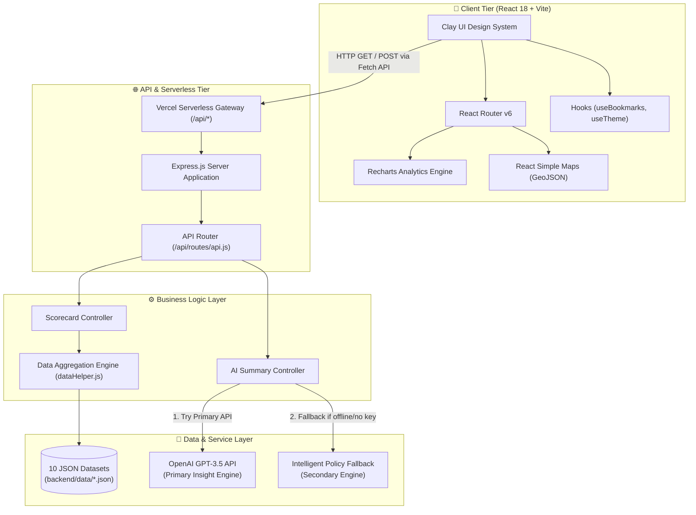
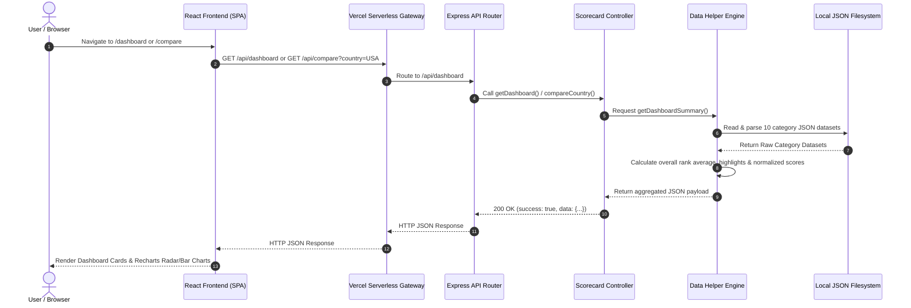
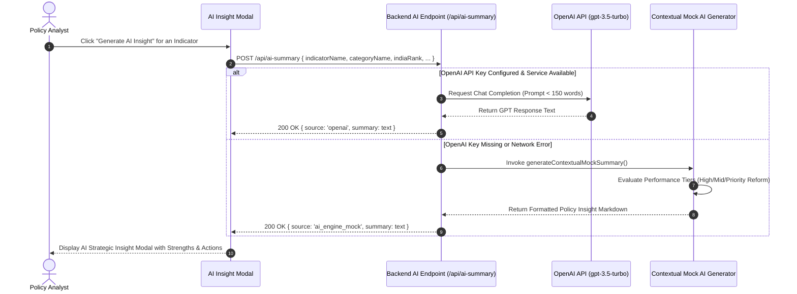
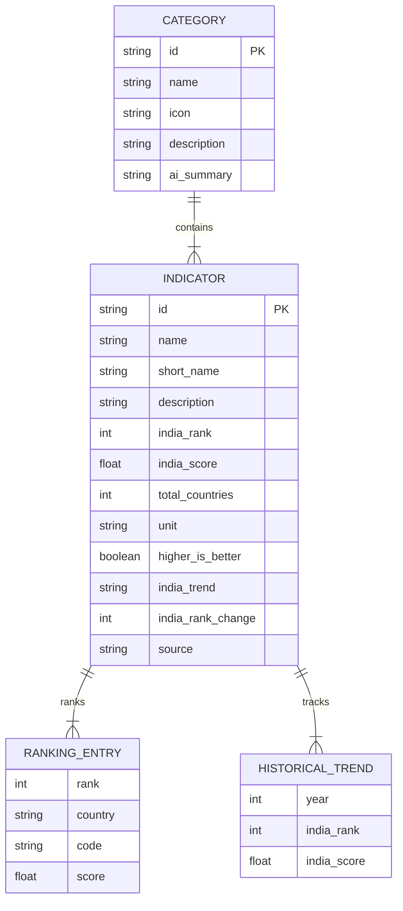
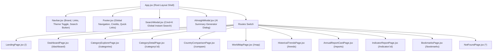
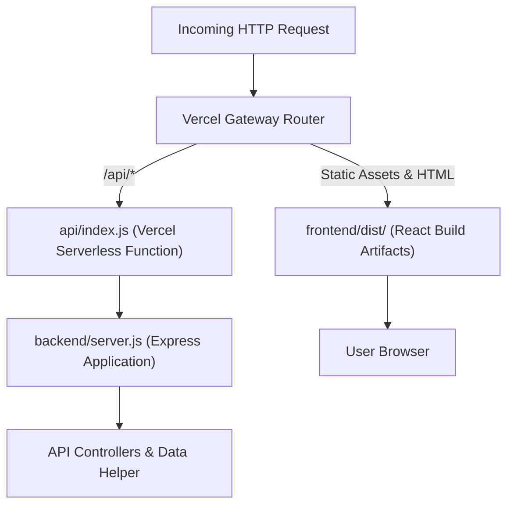

# 🏛️ System Architecture & Design Documentation
## 🇮🇳 India Global Scorecard

Welcome to the comprehensive architecture, system design, data schema, and technical implementation reference for the **India Global Scorecard** application.

---

## 📋 Table of Contents

- [1. System Overview](#1-system-overview)
- [2. High-Level System Architecture](#2-high-level-system-architecture)
- [3. Data Architecture & International Sources](#3-data-architecture--international-sources)
  - [3.1 Data Sources & Indicator Pillars](#31-data-sources--indicator-pillars)
  - [3.2 Benchmark Nations](#32-benchmark-nations)
  - [3.3 Dataset Data Model Schema](#33-dataset-data-model-schema)
- [4. Frontend Architecture & Design System](#4-frontend-architecture--design-system)
  - [4.1 Component Hierarchy & Route Mapping](#41-component-hierarchy--route-mapping)
  - [4.2 Clay Design System & UI Tokens](#42-clay-design-system--ui-tokens)
  - [4.3 Client State & Custom Hooks](#43-client-state--custom-hooks)
- [5. Backend Architecture & API Engine](#5-backend-architecture--api-engine)
  - [5.1 API Endpoint Reference](#51-api-endpoint-reference)
  - [5.2 Data Calculation & Normalization Engine](#52-data-calculation--normalization-engine)
  - [5.3 AI Insight Generator & Fallback Pipeline](#53-ai-insight-generator--fallback-pipeline)
- [6. Deployment & Serverless Infrastructure](#6-deployment--serverless-infrastructure)
- [7. Complete Repository File Structure](#7-complete-repository-file-structure)

---

## 1. System Overview

The **India Global Scorecard** is a production-quality development intelligence platform. It consolidates authoritative international index datasets from top multilateral organizations (World Bank, UNDP, WIPO, WEF, WHO, UNESCO, Yale EPI, Transparency International, UN DESA, IEP, ITU) into an interactive scorekeeping platform.

### Core System Goals
1. **Pillar Scorekeeping**: Monitor 10 core developmental pillars spanning Economy, Governance, Healthcare, Technology, Environment, and Social Development.
2. **Cross-Country Benchmarking**: Enable bilateral comparison of India with 15+ benchmark nations using Recharts Radar & Bar visualizations.
3. **Policy Insight Generation**: Provide AI-assisted executive summaries evaluating India's competitive strengths, vulnerabilities, and reform opportunities.
4. **Zero-Latency Data Access**: Serve optimized static datasets with server-side aggregation and instant fuzzy search capabilities.
5. **Serverless Portability**: Run seamlessly in standalone Express environments or as zero-configuration Vercel Serverless Functions.

---

## 2. High-Level System Architecture

The application adopts a **Tiered Client-Server Architecture** decoupled into a React SPA frontend and a lightweight Express REST backend API, integrated via Vercel Serverless Functions.



### UML Sequence Diagrams

#### A. Data Fetching & Scorecard Aggregation Sequence



#### B. AI Insight Generation & Intelligent Fallback Sequence



---

## 3. Data Architecture & International Sources

### 3.1 Data Sources & Indicator Pillars

The application aggregates metrics across **10 distinct developmental pillars**. Each pillar is supported by trusted multilateral international datasets:

| Pillar | Category ID | Primary Data Source | Key Metrics Included | Total Indicators |
| :--- | :--- | :--- | :--- | :---: |
| **Economy** | `economy` | World Bank, IMF | Nominal GDP, GDP Growth Rate, Inflation Rate, Foreign Direct Investment, Export Scale, Public Debt % | 6 |
| **Society** | `society` | UNDP, UN DESA | Human Development Index (HDI), Multidimensional Poverty Rate, Urbanization Ratio, Population Growth | 4 |
| **Governance** | `governance` | World Bank, Transparency Int. | Rule of Law Index, Corruption Perception Index, Regulatory Quality, Ease of Doing Business | 4 |
| **Education** | `education` | UNESCO, OECD | Adult Literacy Rate, STEM Graduate Percentage, Tertiary Enrolment Ratio, PISA Math/Science | 4 |
| **Healthcare** | `healthcare` | WHO, IHME | Life Expectancy, Healthcare Access & Quality Index, Infant Mortality Rate, Hospital Beds per 1,000 | 4 |
| **Technology** | `technology` | WIPO, ITU | Global Innovation Index (GII), Gross R&D Expenditure % GDP, High-Tech Exports, Mobile Broadband Penetration | 4 |
| **Environment** | `environment` | Yale EPI, IRENA | Environmental Performance Index (EPI), Renewable Energy Share, Carbon Intensity, Forest Cover % | 4 |
| **Safety** | `safety` | IEP, ITU | Global Peace Index (GPI), Cyber Security Index (NCSI), Homicide Rate | 3 |
| **Equality** | `equality` | World Economic Forum | Global Gender Gap Index, Income Gini Coefficient, Female Labor Force Participation | 3 |
| **Digital Govt** | `digital_government` | UN DESA | UN E-Government Development Index, Digital Public Infrastructure Scale, Open Data Index | 3 |

### 3.2 Benchmark Nations

India's trajectory is contextualized against **15 benchmark nations** selected across global economic categories:

```mermaid
graph LR
    subgraph Target Nation
        IN["🇮🇳 India (IN) - South Asia"]
    end

    subgraph Developed Benchmarks ["Developed Economies"]
        US["🇺🇸 USA (US)"]
        JP["🇯🇵 Japan (JP)"]
        DE["🇩🇪 Germany (DE)"]
        GB["🇬🇧 UK (GB)"]
        FR["🇫🇷 France (FR)"]
        CA["🇨🇦 Canada (CA)"]
        AU["🇦🇺 Australia (AU)"]
        SG["🇸🇬 Singapore (SG)"]
        KR["🇰🇷 South Korea (KR)"]
    end

    subgraph Emerging & Peer Benchmarks ["Emerging / Regional Peers"]
        CN["🇨🇳 China (CN)"]
        BR["🇧🇷 Brazil (BR)"]
        RU["🇷🇺 Russia (RU)"]
        BD["🇧🇩 Bangladesh (BD)"]
        PK["🇵🇰 Pakistan (PK)"]
        LK["🇱🇰 Sri Lanka (LK)"]
    end

    IN <--> Developed Benchmarks
    IN <--> Emerging & Peer Benchmarks
```

### 3.3 Dataset Data Model Schema

Every pillar dataset file (`backend/data/<category>.json`) adheres to the following structured JSON schema:



---

## 4. Frontend Architecture & Design System

### 4.1 Component Hierarchy & Route Mapping

The React frontend uses **React Router v6** for single-page dynamic routing paired with reusable UI components:



### 4.2 Clay Design System & UI Tokens

The frontend design system is defined in `frontend/src/index.css` using CSS custom variables and modern visual ergonomics:

- **Canvas & Card Palette**: Soft cream canvas (`#FDFBF7`), saturated feature cards (Pink `#FDF2F8`, Teal `#F0FDFA`, Lavender `#F3E8FF`, Peach `#FFF7ED`, Ochre `#FEF3C7`).
- **Glassmorphism**: Soft background blur (`backdrop-filter: blur(12px)`), semi-transparent borders (`rgba(0,0,0,0.06)`).
- **Typography**: Inter / System Sans-Serif font stack with balanced line heights and font weights (400, 500, 600, 700).
- **Theme Persistence**: Light and dark mode support via CSS variables (`[data-theme="dark"]`).

### 4.3 Client State & Custom Hooks

| Custom Hook | File Location | Responsibility |
| :--- | :--- | :--- |
| `useBookmarks` | [useBookmarks.js](file:///d:/projects/Let%27scodedev-challenge/frontend/src/hooks/useBookmarks.js) | Manages saved indicators in browser `localStorage`, providing `addBookmark`, `removeBookmark`, `isBookmarked`. |
| `useTheme` | [useTheme.js](file:///d:/projects/Let%27scodedev-challenge/frontend/src/hooks/useTheme.js) | Toggles light/dark theme, synchronizes with `localStorage` and system `prefers-color-scheme`. |
| `useAuth` | [useAuth.js](file:///d:/projects/Let%27scodedev-challenge/frontend/src/hooks/useAuth.js) | Stub authentication hook prepared for future multi-user role management. |

---

## 5. Backend Architecture & API Engine

### 5.1 API Endpoint Reference

The Express backend exposes REST endpoints under the `/api` namespace:

| HTTP Method | Route Endpoint | Controller Handler | Description & Payload |
| :--- | :--- | :--- | :--- |
| **GET** | `/api/dashboard` | `scorecardController.getDashboard` | Returns overall rank average, total indicator count, top highlight rankings, and pillar summaries. |
| **GET** | `/api/categories` | `scorecardController.getCategories` | Returns array of all 10 pillar datasets with indicators and rankings. |
| **GET** | `/api/category/:id` | `scorecardController.getCategoryById` | Returns full details for a specific pillar (e.g. `economy`, `governance`). |
| **GET** | `/api/countries` | `scorecardController.getCountries` | Returns list of 16 benchmark nations with ISO codes, flags, and regional groupings. |
| **GET** | `/api/country/:name` | `scorecardController.getCountryByName` | Returns full cross-pillar profile data for a target country. |
| **GET** | `/api/compare` | `scorecardController.compareCountry` | Query `?country=USA`. Computes bilateral strength vs headroom/weakness analysis and normalized radar scores. |
| **GET** | `/api/search` | `scorecardController.search` | Query `?q=gdp`. Performs fuzzy text search across categories, indicators, and country names. |
| **POST** | `/api/ai-summary` | `aiController.generateSummary` | Accepts indicator & country context. Generates executive summary via OpenAI or fallback mock engine. |

### 5.2 Data Calculation & Normalization Engine

In `backend/utils/dataHelper.js`, radar chart scores for bilateral country comparison are normalized using the formula:

$$\text{NormalizedScore} = \max\left(10, \text{round}\left(100 - \text{avgRank} \times 0.7\right)\right)$$

- High global ranks (e.g., Rank 1 to 5) yield normalized performance scores between 96 and 100.
- Moderate global ranks (e.g., Rank 40 to 60) yield scores between 58 and 72.
- Lower ranks are bounded at a minimum baseline of 10 to ensure clean radar chart visualization without scale distortion.

### 5.3 AI Insight Generator & Fallback Pipeline

The AI Insight Controller (`backend/controllers/aiController.js`) guarantees **100% operational uptime**:

1. **Primary Provider**: Calls `https://api.openai.com/v1/chat/completions` using the `gpt-3.5-turbo` model if `OPENAI_API_KEY` exists in environment variables.
2. **Fallback Engine**: If `OPENAI_API_KEY` is undefined, invalid, or rate-limited, it automatically invokes `generateContextualMockSummary()`.
3. **Context Sensitivity**: Evaluates whether the rank falls into:
   - **High Performance Vector** ($\text{Rank} \le 30$)
   - **Emerging Growth Category** ($30 < \text{Rank} \le 80$)
   - **Priority Transformation Category** ($\text{Rank} > 80$)
   - **Bilateral Comparison Context** (analyzing comparative advantage vs target country).

---

## 6. Deployment & Serverless Infrastructure

The project is structured for zero-cost deployment on **Vercel** using Vercel Serverless Functions:



### Vercel Configuration (`vercel.json`)
```json
{
  "version": 2,
  "buildCommand": "cd frontend && npm install && npm run build",
  "outputDirectory": "frontend/dist",
  "rewrites": [
    { "source": "/api/(.*)", "destination": "/api/index.js" },
    { "source": "/(.*)", "destination": "/index.html" }
  ]
}
```

---

## 7. Complete Repository File Structure

```
Let'scodedev-challenge/
├── architecture.md             # Complete system design & architecture manual (This File)
├── DEPLOYMENT.md               # Step-by-step production deployment guide
├── design.md                   # Detailed frontend design specification & UI system tokens
├── README.md                   # Project overview & developer quickstart guide
├── package.json                # Monorepo top-level script configurations
├── vercel.json                 # Monorepo deployment & rewrite specification
│
├── api/                        # Vercel Serverless Function Bridge
│   └── index.js                # Imports backend server application as serverless handler
│
├── backend/                    # Express.js REST API & Data Engine
│   ├── controllers/            # Controller Request Handlers
│   │   ├── aiController.js     # AI insight generation & fallback engine logic
│   │   └── scorecardController.js # REST handlers for scorecards, comparison, and search
│   ├── data/                   # 10 Multilateral JSON Datasets
│   │   ├── digital_government.json
│   │   ├── economy.json
│   │   ├── education.json
│   │   ├── environment.json
│   │   ├── equality.json
│   │   ├── governance.json
│   │   ├── healthcare.json
│   │   ├── safety.json
│   │   ├── society.json
│   │   └── technology.json
│   ├── routes/                 # Express API Endpoint Definitions
│   │   └── api.js              # Router declaring /api/* endpoints
│   ├── utils/                  # Core Business & Aggregation Helpers
│   │   └── dataHelper.js       # Data loader, rank averager, radar calculator, fuzzy search
│   ├── .env                    # Environment variables (OPENAI_API_KEY, PORT)
│   ├── package.json            # Backend Node.js dependencies
│   └── server.js               # Express standalone server entry point
│
└── frontend/                   # React (Vite) SPA Client
    ├── src/
    │   ├── components/         # Clay UI & Visualization Components
    │   │   ├── AiInsightModal.jsx          # Modal for AI executive insights
    │   │   ├── CategoryCard.jsx            # Pillar card with rank badge & stats
    │   │   ├── ComparisonBarChart.jsx      # Recharts bar chart for bilateral gap analysis
    │   │   ├── ComparisonRadarChart.jsx    # Recharts radar chart for 10-pillar comparison
    │   │   ├── Footer.jsx                  # Footer layout with credits & links
    │   │   ├── IndiaGlobeIllustration.jsx  # SVG vector illustration element
    │   │   ├── IndicatorCard.jsx           # Individual indicator scorecard card
    │   │   ├── Navbar.jsx                  # Header navigation, search launcher & theme toggle
    │   │   ├── SearchModal.jsx             # Cmd+K fuzzy search modal overlay
    │   │   ├── SkeletonLoader.jsx          # UI loading placeholder component
    │   │   ├── StatCard.jsx                # Key performance metric card
    │   │   ├── TrendLineChart.jsx          # Recharts historical trend line & area chart
    │   │   └── WorldMap.jsx                # React Simple Maps interactive choropleth map
    │   ├── hooks/              # Reusable React Custom Hooks
    │   │   ├── useAuth.js                  # Authentication stub hook
    │   │   ├── useBookmarks.js             # LocalStorage bookmark manager
    │   │   └── useTheme.js                 # Theme persistence hook (light/dark)
    │   ├── pages/              # SPA View Pages
    │   │   ├── AnnualReportCardPage.jsx    # Complete executive scorecard report page
    │   │   ├── BookmarksPage.jsx           # Saved user indicators view
    │   │   ├── CategoryDetailPage.jsx      # Single pillar detailed view
    │   │   ├── CategoryExplorerPage.jsx    # All 10 pillars overview grid
    │   │   ├── CountryComparisonPage.jsx   # Bilateral country comparison view
    │   │   ├── DashboardPage.jsx           # Main executive scorekeeping dashboard
    │   │   ├── HistoricalTrendsPage.jsx    # Multi-year trajectory analytics view
    │   │   ├── IndicatorReportPage.jsx     # Deep dive single indicator report page
    │   │   ├── LandingPage.jsx             # Platform landing page & hero section
    │   │   ├── NotFoundPage.jsx            # 404 Error page
    │   │   └── WorldMapPage.jsx            # Interactive world map view
    │   ├── services/           # Backend API Client Service
    │   │   └── api.js                  # Async fetch wrappers for REST API
    │   ├── utils/              # Client Utilities & Helpers
    │   │   ├── constants.js            # App configuration constants
    │   │   ├── exportUtils.js          # CSV & JSON data export helpers
    │   │   └── formatters.js           # Number & rank display formatters
    │   ├── App.jsx             # Main Router layout wrapper & modal state
    │   ├── index.css           # Clay UI design tokens, reset & CSS utilities
    │   └── main.jsx            # Vite DOM mount entry point
    ├── package.json            # Frontend Node.js dependencies
    └── vite.config.js          # Vite build & dev proxy configuration
```

---

*Documentation compiled for India Global Scorecard System Architecture.*
